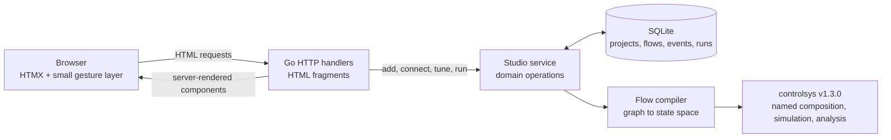

# Process Lab

Process Lab is a browser-based workspace for dynamic-system simulation, control
design, and analysis. Build persistent process flowsheets, connect scalar and
named MIMO signals, simulate continuous and discrete models, inspect responses
and robustness, and design or tune controllers in one engineering workbench.

The seeded starter project models two first-order paths feeding an energy balance:

- a setpoint through valve gain and reactor dynamics;
- a disturbance through jacket dynamics and heat loss;
- a summed temperature output rendered as an SVG trend.

The expected steady-state value is `1.8 + (0.3 × -0.7) = 1.59`, which is also asserted by the simulation tests.

## Run it

Requirements:

- Go 1.26.3 or newer

```bash
go run ./cmd/processlab serve
```

Open [http://127.0.0.1:8080](http://127.0.0.1:8080). The first run creates `processlab.db` and seeds the reactor example. The address serves the drawing register; open the seeded project from there.

The same server exposes the client CLI. In another terminal, list projects or
run a simulation without opening the database from the client process:

```bash
go run ./cmd/processlab project list
go run ./cmd/processlab sim run --flow 1 --duration 10 --sample-time 0.1
```

See [`docs/cli.md`](docs/cli.md) for the stream contract, exit codes, JSON
mode, and generated command reference.

To use another address or database:

```bash
go run ./cmd/processlab serve --addr 127.0.0.1:9090 --db ./plant.db
```

All CSS, application JavaScript, HTMX 2.0.10, and HTML templates are embedded
in the Go binary. The browser application therefore has no runtime CDN
dependency. The vendored HTMX license is served from
`/assets/htmx-LICENSE.txt`.

## Run with Docker Compose

With Docker Desktop or another Docker Engine running:

```bash
docker compose up --build --detach
docker compose ps
```

Open [http://127.0.0.1:8080](http://127.0.0.1:8080). Compose builds a small
non-root image and stores `processlab.db` in the named
`processlab-data` volume, so projects and flowsheets survive container
replacement and restarts.

If port 8080 is already in use, choose another host port:

```bash
PROCESSLAB_PORT=9090 docker compose up --build --detach
```

Follow logs or stop the deployment with:

```bash
docker compose logs --follow
docker compose down
```

`docker compose down` preserves the database volume. Run
`docker compose down --volumes` only when you intentionally want to delete all
containerized Process Lab data.

The CLI can target the Compose server from the host with
`processlab --server http://127.0.0.1:8080 <command>`. The CLI is a separate
client and does not read the Compose volume.

## Projects, flowsheets, and persistence

Process Lab organizes top-level flowsheets inside projects.

`/` is the drawing register: one line per project, carrying its sheet count and
when it was last edited, and a row expands to reveal that project's flowsheets.
It replaces the old redirect into a flowsheet, so the application opens by
showing what exists rather than dropping you into whichever sheet it saw last.

- The last line of the register creates a project. It starts with one empty
  flowsheet named `Untitled flowsheet`.
- A project name opens that project's first sheet. A sheet chip in an expanded
  row opens that sheet directly, so the home screen reaches a sheet in one
  click.
- Double-click a project name, or use **Rename** on its row, to rename it in
  place. **Delete** removes the project and everything under it after a
  confirmation naming the project and its sheet count. The last remaining
  project offers no Delete.

Inside a project the flowsheets are a tab strip across the bottom of the
workbench, below the simulation dock and above the readout rail, so it stays
visible whatever the rails and the dock are doing:

| Gesture or control | Action |
| --- | --- |
| Click a tab | Open that sheet; only the workbench is swapped, so the page does not flash |
| Double-click a tab | Rename it in place; `Enter` commits, `Esc` puts the old name back |
| Right-click a tab | Rename, Duplicate, Delete |
| Drag a tab | Move it along the strip; an insertion marker shows where it lands |
| `Ctrl`/`Cmd` + `Shift` + `←` / `→` | Move the open sheet one place |
| `+` | Add a sheet named `Flowsheet N` and open its tab in rename, with no dialog |
| `‹ ›` | Scroll the strip one tab when there are more tabs than fit |
| `N sheets` | A jump list of every sheet in the project |

Duplicating a sheet copies its blocks, their parameters and positions, and the
wiring between them; run history is not copied. The copy is named `‹name› copy`
and lands immediately right of the sheet it came from. Deleting the open sheet
opens its left neighbour, or its right neighbour when it was the first tab, and
deleting the project you are inside returns you to the register. A project
always keeps at least one flowsheet, which is what guarantees the tab strip is
never empty.

A tab carries an amber dot when its model changed since its last simulation.
That is the same condition the simulation dock uses to call a chart stale, so
the tab and the chart cannot disagree.

The dock is a focused engineering workspace with canonical, copyable modes:
**Simulation**, **Design**, **Dynamics**, **Frequency**, **Loop**, and
**Compare**. The selected mode lives in the `?view=` query, so ordinary links,
reloads, browser history, and HTMX swaps reproduce the same view. Design keeps
the controller candidate review, apply, and undo workflow separate from the
analysis views.

Simulation and analysis plots render server-owned linear or logarithmic axes,
engineering tick labels, grids, and applicable reference lines. Move the
pointer across a plot or focus it and use `Left`, `Right`, `Home`, and `End` to
inspect rendered values; `Escape` clears a linked cursor. Bode magnitude and
phase share their frequency cursor. The plot toolbar can show or hide
characteristics, zoom from 100% to 400%, clear the cursor, or reset the view.
Series controls remain keyed to stable channel identities across HTMX swaps.

Simulation keeps a bounded newest-first run history. Every stored run offers a
CSV attachment whose columns identify block, port, and channel. Compare uses
the newest current-model run against an older selected baseline, matches
channels by that identity tuple, overlays current and dashed baseline traces,
interpolates the baseline onto the current time grid for a difference plot,
and lists unmatched channels. A baseline from an older model revision remains
valid historical evidence and is labeled with a warning; a stale current run
must be rerun before comparison.

The topbar carries **Projects**, a link back to the register, and a switcher
naming the open project that lists the others and creates a new one. The
flowsheets of the open project are the tab strip's subject and are not repeated
there.

Every edit is saved to the SQLite file passed with `-db`; there is no separate
save command. Stop the server with `Ctrl+C`, then run it again with the same
database path to reopen the workspace:

```bash
go run ./cmd/processlab serve --db ./plant.db
```

Each sheet has a canonical URL that stays valid across restarts, for example
`/projects/2/flows/5`, and switching tabs pushes it, so Back walks the sheets
you visited. Use a stable `-db` path when starting the server from different
working directories.

Databases from versions without projects are migrated at startup. Existing
flowsheets are retained inside a default `Process Lab project`, and their tabs
open in the order the old flowsheet menu listed them — by name, ignoring case —
after which the order is yours to change and is stored per project.

Projects currently contain independent top-level flowsheets. Hierarchical
subflowsheet or subsystem blocks inside a flowsheet are not yet supported.

## Try the workbench

1. Run the seeded model and inspect the temperature response and settling metric.
2. Right-click empty canvas and add a block; it lands where you clicked.
3. Drag from an orange output port to a gray input port to wire a signal.
   A Sum draws one labeled input port per `+`/`-` sign.
4. Click a block to edit its name or numerical parameter in the inspector.
5. Drag a block. It snaps to the grid and shows guides when it lines up with a neighbour.
6. Drag a box around several blocks and move them together.
7. Collapse the side rails and drag the dock down to give the sheet the whole window.

Press `?` for the full shortcut sheet.

## Workbench interaction

On desktop, the window is a fixed application shell: the canvas is the only
region that grows. At 860px and below, the interface stacks and the page
scrolls so every control remains reachable without horizontal overflow. Both
side rails collapse to a 46px icon strip — the collapsed library still adds
blocks — and the simulation dock at the bottom drags between a header-only
state and 70% of the window. Those choices persist across reloads. The
flowsheet tab strip spans the full width below the dock, outside the rails, so
collapsing anything never takes the other sheets with it.

The sheet is a 6000×4000 world on a 20px grid, viewed through a pan/zoom
viewport at 25%–400%.

| Gesture | Action |
| --- | --- |
| Wheel | Pan |
| `Cmd`/`Ctrl` + wheel, or pinch | Zoom about the pointer |
| Space + drag, or middle-drag | Pan |
| Drag empty canvas | Select blocks with a marquee (`Shift` extends) |
| Drag a block | Move it, snapped to the grid; moves the whole selection |
| `Alt` + drag | Suspend alignment magnetism (still snaps to the grid) |
| Drag a specific output port to a specific input port | Wire a signal to that terminal |
| Click output, then input | Wire without dragging; Enter or Space works on focused ports |
| Right-click | Context menu on a block or on the canvas |

| Keys | Action |
| --- | --- |
| `Delete` / `Backspace` | Delete the selection |
| Arrows / `Shift` + arrows | Nudge one / five grid steps |
| `Cmd`/`Ctrl` + `A` | Select every block |
| `Cmd`/`Ctrl` + `D` | Duplicate (wiring between blocks is not copied) |
| `Cmd`/`Ctrl` + `=` / `−` / `0` | Zoom in / out / reset |
| `Shift` + `1` | Fit the flowsheet to the window |
| `Esc` | Cancel wiring, or clear the selection |
| `Cmd`/`Ctrl` + `Enter` | Run the model |
| `Cmd`/`Ctrl` + `Shift` + `←` / `→` | Move the open sheet along the tab strip |
| `?` | Shortcut sheet |

The status bar is a live readout rail: cursor position in sheet
coordinates, zoom, grid pitch, selection count, block and signal counts,
and solver state.

`docs/workbench-ergonomics.md` records the interaction model, the state
that lives on the client, and the constraints behind these choices.

## Stack and request flow



HTMX performs every server mutation and swaps the returned `#workbench` fragment. A small framework-free JavaScript layer handles only interactions that must stay in the browser: the pan/zoom viewport, pointer dragging and grid snapping, marquee selection, provisional signal lines, port gestures, context menus, and keyboard shortcuts. Every mutation still persists through `htmx.ajax`.

Because the swap replaces the whole fragment, all client-held state — viewport, selection, rail and dock sizing — is re-applied after each swap and stored in `localStorage` rather than in the flow record. Multi-selection is deliberately client-side, so the server keeps its single `selected` parameter for the inspector and a marquee costs no round trips.

The Go handlers state user intent and call one cohesive service operation. They do not coordinate SQL transactions or simulation steps. The `studio` package owns block defaults, validation, placement, interconnection validation, persistence, graph compilation, simulation, and stale-result rules.

The complete controlsys coverage map—including browser workflows, bounded
Studio APIs, explicit deferrals, numerical evidence, and runnable
representative fixtures—is in
[`docs/controlsys-capability-matrix.md`](docs/controlsys-capability-matrix.md).

## Supported blocks

| Library | Block | Behavior | Input rule |
| --- | --- | --- | --- |
| Sources | Step | Configurable initial value, final value, and step time | No input |
| Sources | Constant | Constant signal | No input |
| Sources | Vector Constant | Named constant vector | No input |
| Sources | Sine Wave | Biased sinusoid with amplitude, angular frequency, and phase | No input |
| Math | Gain | Multiplies its input by `K` | Exactly one |
| Math | Matrix Gain | Named vector relation `y = Du` | One vector input |
| Math | Mux / Demux | Assemble scalar channels into a named vector, or decompose one | Named scalar ports / one named vector |
| Math | Selector / Permutation | Select a named subset, or reorder a complete named channel set | One named vector |
| Math | Sum | Adds, subtracts, or reduces scalar and explicitly sized vector inputs | One input port per sign |
| Math | Vector Sum | Adds or subtracts named vectors | One vector input port per sign |
| Continuous | First-order Lag | `1 / (τs + 1)` | Exactly one |
| Continuous | Integrator | `1 / s` with zero initial condition | Exactly one |
| Continuous | Transfer Function | Proper continuous SISO numerator/denominator model | Exactly one |
| Continuous | PID Controller | Parallel PID with Simulink-style derivative filter coefficient N | Exactly one |
| Continuous | Transport Delay | Exact delay metadata by default, or explicit Padé/Thiran approximation | Exactly one |
| Models | State-Space | Named continuous or discrete MIMO `A,B,C,D` realization | One named vector input |
| Models | MIMO Transfer Function | Output-row denominators, per-channel numerators and delays | One named vector input |
| Models | Zero-Pole-Gain | Per-channel zeros, poles, and finite gain matrix | One named vector input |
| Models | Frequency Response Data | Named complex MIMO samples on an explicit rad/s grid | Frequency-domain workflows only |
| Discrete | Unit Delay | Exact one-sample scalar or vector state at an explicit or inherited rate | Exactly one |
| Discrete | Transfer Function | Proper SISO numerator/denominator model in `z` | Exactly one |
| Discrete | State-Space | Named MIMO `x[k+1]=Ax[k]+Bu[k]`, `y[k]=Cx[k]+Du[k]` | One named vector input |
| Discrete | Discretized Transfer | Explicit ZOH, FOH, matched pole-zero, or impulse-invariant conversion | Exactly one |
| Sinks | Scope | Plots the time-domain signal and response metrics | Exactly one |
| Sinks | Vector Scope | Plots named vector channels | One vector input |
| Sinks | Spectrum Analyzer | Hann-windowed one-sided amplitude spectrum using Gonum FFT | Exactly one |

Flows may branch, merge, and close feedback loops. Named interconnections are
passed to `controlsys.ConnectByName`, which resolves dynamic feedback and
rejects only an unsolvable algebraic loop. Every source owns a separate
external input channel, so Step, Constant, and Sine Wave blocks remain
independent when a model branches or merges.

Each terminal has one catalog-derived width and ordered channel-name list.
Scalar diagrams retain width one and their existing port numbers. A vector is
one connection, not several unrelated wires: connections reject unequal
widths before persistence, then the compiler expands compatible vector
channels into deterministic `ConnectByName` pairs. Matrix Gain, Vector Sum,
Vector Constant, Vector Scope, State-Space, MIMO Transfer Function,
Zero-Pole-Gain, and the routing blocks exercise the same named MIMO feedback
path. Representation dimensions and channel names are validated together, so
a stored model cannot claim a port width that differs from its realization.

State-Space, MIMO Transfer Function, and Zero-Pole-Gain preserve their
authored parameters while delegating realization and conversion to
`controlsys`. Their explicit time-domain choice determines whether `Dt` is
zero or a positive sample time. MIMO transfer functions use the package's
native shape: one denominator per output row, one numerator and delay per
output/input channel. Frequency Response Data owns a strictly increasing
rad/s grid and finite row-major complex response samples. Because controlsys
FRD has no state-space conversion, an FRD block is deliberately
frequency-domain-only until an identification or fitting workflow creates a
time realization.

Transport Delay preserves exact delay metadata through named series and
feedback composition. Exact time simulation requires the delay to be an
integer multiple of the run sample time; otherwise the run reports the nearest
aligned value and asks for an explicit Padé or Thiran approximation. Padé is a
continuous rational model, while Thiran is a discrete all-pass model with its
own sample time. Stored delays created before these choices existed retain
their historical Padé behavior.

Discrete blocks declare an explicit or inherited sample time. An inherited
Unit Delay first resolves from a connected upstream discrete rate, including
through a chain of inherited Unit Delays. When no upstream discrete rate is
available, it retains the existing run-step fallback. Unit Delay carries its
state exactly between samples. Discrete Transfer Function
and State-Space blocks are realized directly at their declared `Dt`.
Discretized Transfer makes conversion a visible model choice—ZOH, FOH,
matched pole-zero, or impulse invariant—rather than silently choosing a
method during compilation.

Every stored run includes a fidelity record: base step, model domain, driver,
segment count, source hold, discrete block rates, rate transitions, and delay
provenance. The simulation dock renders the same record, naming exact,
Padé-order, and Thiran-order delay behavior. Unsupported fractional delay
alignment or unresolved mixed rates fail before simulation rather than
falling back to a hidden approximation.

Connections identify both endpoint ports. For a Sum, sign character `i`
belongs to input port `i`, so deleting and redrawing another wire cannot change
which inputs are added or subtracted. Editing the sign pattern adds ports;
removing a sign is refused while that port still carries a wire.

Each linear block becomes a locally named `controlsys.System`.
`controlsys.ConnectByName` composes compatible realizations into one
state-space model. Continuous delay-free systems use `controlsys.Lsim`;
discrete systems and delay-aware conversions use `System.Simulate` while
carrying `XFinal` between segments. Spectrum Analyzer sinks then apply
Gonum's Hann window and real FFT to their selected response.

Plain continuous `Lsim` is used only when the model is delay-free. A connected
exact delay must first be internalized by named composition and aligned to the
run grid; the engine then takes the explicit delay-aware
`DiscretizeWithOpts` + `Simulate` path so controlsys owns the delay buffers.

Compilation returns one owned model artifact containing the composed system,
stable block/port channel identities, source excitations, selected outputs,
time-domain metadata, dimensions, and a snapshot of the diagram provenance.
Simulation and analysis consume that artifact instead of reconstructing
controlsys channel order or exposing its mutable matrices.

Analysis probes identify a block and output port rather than spelling an
internal controlsys name. The compiler coalesces duplicates in first-request
order and exposes those signals while composing the graph; a later subset is
selected with `controlsys.SelectByName`. Scope and Spectrum Analyzer blocks
remain simulation consumers, not the authority on which signals analysis may
inspect.

`Studio.AnalyzeDynamics` selects one compiled input/output channel pair and
exposes controlsys stability, poles, zeros, DC gain, and damping. A standard
step response is calculated only when the caller declares a step experiment;
its rise, settling, overshoot, undershoot, peak, peak-time, and steady-state
metrics are separate from the arbitrary-source metrics stored on normal
simulation runs. Undefined operations return named issues beside any valid
partial results rather than non-finite JSON values.

`Studio.AnalyzeFrequency` selects one or more named input/output channels.
It reports Bode paths in dB and unwrapped degrees, SISO Nyquist and Nichols
data, and linear singular values for rectangular MIMO models. Frequency grids
are always angular frequency in rad/s; callers may provide a strictly
increasing grid or request an automatic one. Discrete grids end at `π/Dt`.
This model frequency response is distinct from the Spectrum Analyzer, which
is an FFT of one sampled simulation signal.

`Studio.AnalyzeLoop` requires one explicit named input/output channel pair. It
does not infer a loop from diagram topology. The report uses controlsys for
classical and all-crossing margins, bandwidth, peak-sensitivity modulus
margin, root locus, and sampled passivity evidence. Every operation carries
applicability metadata: exact internal delays retain frequency-crossing
margins but do not claim finite-order bandwidth or root-locus results, and a
sampled passivity pass is never presented as an analytic certificate.

`Studio.RunAnalysis` is the workbench boundary for those analysis intents. It
owns the snapshot, named-channel selection, calculation, persisted latest
result per intent, and revision comparison. Dynamics, frequency, and loop
results persist independently across restarts and are shown in their focused
workbench modes; a model edit keeps them visible but marks them stale, while a
layout-only move leaves their model revision current. Frequency analysis can
select every named input and output, rendering each deterministic
`output ← input` Bode magnitude and phase trace plus MIMO singular values.
Legend controls hide or show the same stable trace key across HTMX swaps.

`Studio.AssignControlRoles` persists an explicit, versioned control-model
contract rather than inferring a plant or controller from canvas topology.
The contract owns ordered plant and controller block membership, named
exogenous/control/performance/measurement boundaries, and named MIMO analysis
points at plant inputs or outputs. Channel names are the durable identity:
consistent port reordering still resolves, while a rename reports the exact
stale assignment.

`Studio.BuildControlModels` resolves that contract once and returns the
controlsys objects required by synthesis workflows: the control-to-measurement
plant, controller, generalized plant ordered as
`[exogenous; control] → [performance; measurement]`, estimator plant, one
`GeneralizedClosedLoop`, and open/closed models for every analysis point.
Subsystems compile independently through the same named block realizations as
simulation. Their synthetic boundary sources exist only during compilation,
so loop breaks and analysis points never alter the drawn model or a normal
simulation. Exact-delay metadata is retained through selection and feedback;
dependency failures are returned as named errors instead of escaping as a
panic.

`Studio.TuneController` adds bounded controlsys tuning without turning the
handler into an optimization script. A request selects stable block/parameter
identities, finite bounds, an explicit analysis point, and any combination of
tracking, rejection, sensitivity, weighted-gain, loop-shape, margin, pole, and
overshoot goals. Gain, Matrix Gain, PID, continuous/discrete transfer
functions, MIMO transfer matrices, and continuous/discrete state-space
controller blocks map to controlsys tunable blocks while retaining an exact
path back to their authored parameters.

GridTune, Systune, and Looptune candidates carry the source model revision,
sampled values and bounds, per-goal diagnostics, failed-goal violations, the
candidate controller, and closed-loop model. The current controlsys Systune
and Looptune implementations use the same bounded Cartesian search as
GridTune, so candidates say so rather than presenting it as continuous
optimization. Candidate generation is read-only.
`Studio.ApplyTuningCandidate` checks the exact source revision and replaces
all selected parameters in one transaction; stale candidates are refused.
Neutral gain controllers inherit a discrete plant's sample time.

Simulation series, metrics, and spectra carry block, port, channel index, and
channel name together. Vector results therefore keep deterministic labels and
ordering through JSON persistence, rendering, and export instead of relying on
slice position. A run is bounded to 5,000 samples and 16 plotted channels;
frequency analysis is bounded to 2,000 points and 64 input-output traces.
`/flows/{id}/results.json` exports the versioned latest simulation and all
three latest analysis intents. The bounded simulation-history API exposes
stored run summaries and exact flow-owned run records, while
`/flows/{id}/simulations/{run-id}.csv` exports one run. Duplicating a flowsheet
deliberately copies the model but not old results, because the new sheet has
not been evaluated.

Named vector routing is explicit diagram algebra. Mux assembles scalar ports
into one named vector; Demux decomposes it; Selector emits a validated named
subset; Permutation requires and reorders the complete channel set. Each is a
static `controlsys.NewGain` selection matrix, so vector fan-out, MIMO sums,
feedback, simulation, and analysis all use the same named interconnection
compiler. Missing or duplicate channel names are rejected before compilation.

The linear boundary is deliberate. Continuous and discrete state-space,
transfer-function, delay, and named MIMO models stay within controlsys.
Continuous/discrete mixtures and unresolved multirate execution are refused
with the required conversion or scheduling action. Product, Saturation,
Switch, Relay, and logic blocks require a nonlinear or hybrid solver; this
compiler does not silently linearize them.

The module pins `github.com/jamestjsp/controlsys` to `v1.3.0` and includes the Gonum fork replacement required by that package.

## SQLite data

The database stores:

- projects and their top-level flowsheets;
- flows, their place in the project's tab strip, and separate layout/model
  update timestamps;
- blocks, positions, and version-tolerant JSON parameters;
- signal connections with source and target port indices, foreign keys, tuple
  uniqueness, and a domain rule that each target port accepts one wire;
- recent activity events;
- complete simulation runs as identity-keyed JSON time series;
- the latest dynamics, frequency, and loop analysis record per flowsheet;
- one versioned plant/controller role specification per flowsheet.

Model edits invalidate the displayed result, while layout-only moves and
flowsheet renames do not. Historical runs remain in SQLite. Schema startup
migrates databases created before projects, tab order, model timestamps, JSON
block parameters, or connection ports were introduced. During the port
migration, every source endpoint becomes port 0 and target endpoints are
numbered per target by their old connection order. Non-Sum blocks could carry
only one input and therefore remain on target port 0; Sum inputs retain the
positions the old compiler gave their signs. Reopening the migrated database
does not renumber it. Deleting a project reaches its flowsheets, blocks,
connections, events, and runs through `ON DELETE CASCADE`, so foreign keys are
turned on in the connection string rather than left to a pragma on whichever
connection happens to run it.

## Project structure

```text
cmd/processlab/           executable and graceful HTTP shutdown
cmd/processlab-docs/      generated CLI and block-catalog reference command
internal/studio/          domain, SQLite repository, compiler, simulation
internal/web/             handlers, view models, embedded templates and assets
browser/                  Chrome tests for swap, history, and restore behaviour
docs/                     capability notes and the generated CLI reference
.ergo/plans.jsonl         dependency-ordered implementation history
```

## Validate it

```bash
gofmt -w cmd internal
go vet ./...
go test -race ./...
go build ./cmd/processlab
npm install && npm run test:browser
```

The Go tests also execute the CLI documentation examples and check the
generated section of [`docs/cli.md`](docs/cli.md) against the current command
help and block catalog. Run the browser suite after the Go suite; it needs
Google Chrome and a running Docker-free local server fixture.

The Go suite covers everything the server decides. The browser suite covers
what only a browser can show: that switching sheets pushes the canonical URL
and moves the document title with it, that going back restores a page whose
`#workbench` swap target still works, and that a history restore which misses
htmx's snapshot cache is answered by the server with a complete document
rather than a fragment. It builds and drives the real binary against a
throwaway database, and fails the run on any console error, failed request, or
4xx. It needs Google Chrome; set `CHROME_PATH` if it is not at the default
macOS location.

The persistent tests cover project and flowsheet lifecycle operations —
including the refusal to delete the last project or the last flowsheet,
duplicate fidelity down to block parameters and remapped connection ids, and
reorder rejecting ids from another project — SQLite round trips, legacy
migration and the per-project tab-order backfill, the register query's counts
and stale-run flag, grid snapping and the sheet bounds, collision-free block
placement, connection constraints, feedback and algebraic-loop handling, analytic control-block
responses, FFT peak detection, HTML fragment behavior, embedded assets,
multi-field HTTP editing flows, and the batch move, delete, and duplicate
endpoints including rejection of ids from another flow.

The control-model contract tests independently check SISO frequency response
and closed-loop algebra, named 2×2 ordering, consistent channel reordering,
mixed-domain refusal, exact-delay retention, corrupt and mismatched storage
versions, legacy migration with no inferred roles, restart round trips,
full-sheet role remapping, and atomic role removal when a referenced block is
deleted.

The generalized-tuning tests independently verify boundary optima,
conflicting-goal evidence, all eight goal families, named MIMO matrix
dimensions, transfer-function and state-space parameter round trips, discrete
sample-time inheritance, non-mutating candidate generation, atomic apply, and
stale-candidate refusal.

The guided-controller tests cover every `controlsys.Pidtune` type, independent
crossover and phase-margin calculations, PID2 reference/measurement sign
semantics, discrete sample-time preservation, exact-delay disclosure, and
atomic stale-safe apply. Named loop-sensitivity tests check `So+To=I` and
`Si+Ti=I` for noncommutative MIMO models, preserve measurement and control
channel names, and compare current and candidate Bode, singular-value,
H-infinity, and SISO robustness evidence on one frequency grid. See
`docs/pid-design.md` and `docs/loop-sensitivity.md`.

State-design tests independently check CARE and estimator-covariance
residuals, continuous and discrete closed-loop poles, Acker/Place pole
multisets, LQI augmentation, named Estim/Reg/LQG construction, full-state
measurement contracts, cost/covariance validation, signed-control-law
normalization, non-mutating candidates, and atomic stale-safe whole-block
apply. See `docs/state-design.md`.

Controller-review tests cover normalized named-role fingerprints, role-only
staleness, structured design goals, shared-grid time/frequency/robustness
comparisons, PID2 reference-loop evidence, opaque HTMX candidate authority,
atomic apply, and revision-checked undo. See
`docs/controller-candidate-workflow.md`.

Interaction behavior cannot be covered by Go tests. It was verified by driving
real pointer and key gestures against headless Chrome over CDP — 88 checks
across viewport, snapping, selection, keyboard, context menus, and wiring — at
25%, 100%, and 400% zoom.

The port-model pass additionally migrated and reopened a pre-port connection
fixture, grew a Sum's sign list and refused a shrink that would orphan a wire,
then disconnected and pointer-wired the seeded model to Sum ports 0 and 1.
The draft snapped to each labeled port, both port indices survived an HTMX
swap and a reload, and server-rendered and client-redrawn curve coordinates
matched. Focused-port keyboard wiring, cancellation, history restore, dense
16-port hit testing, and unchanged single-port geometry at 25%, 100%, and 400%
also passed. Restoring the seeded `++` signs and running the rewired model
produced the expected displayed final value of `1.591`. The persistent
regression verifies 301 samples, the final-value tolerance, and the settled
metric; the compiler pass also compared every sample and metric bit-for-bit
before and after port-based wiring.

The navigation redesign was verified the same way, end to end in one browser
session: create a project from the register, add sheets with `+`, rename a tab
by double-click, duplicate it, reorder by drag and by keyboard, delete a sheet
and land on the neighbour the domain chose, switch projects from the register
and from the topbar switcher, rename and delete a project, then restart the
server and confirm the register, the tab names, and the tab order came back
unchanged — 77 checks. The same pass was repeated against a database written
before this branch, whose `flows` table had no `position`, `project_id`, or
`model_updated_at` column: it migrated on open, its tabs appeared in the old
by-name order, every new operation worked on it, and a second open did not
re-sort the strip — 46 checks. Rendering was confirmed at 1440, 1280, 860, and
620px on both pages.

Note that templates and static assets are `go:embed`-ed into the binary, so a change to `static/js/*.js` or `app.css` needs a rebuild before the server serves it.
